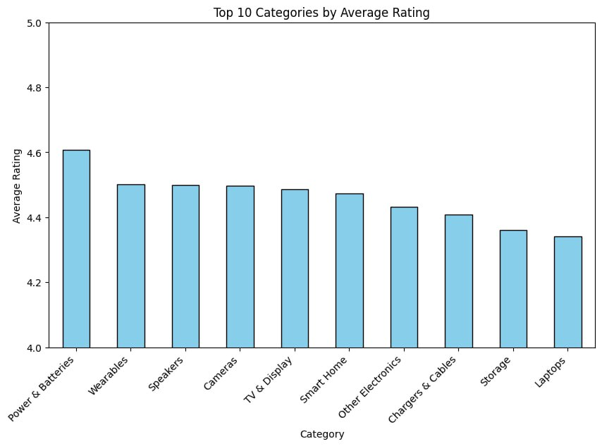
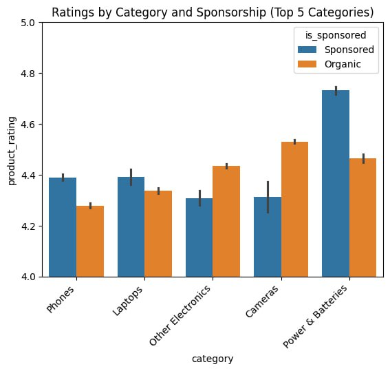
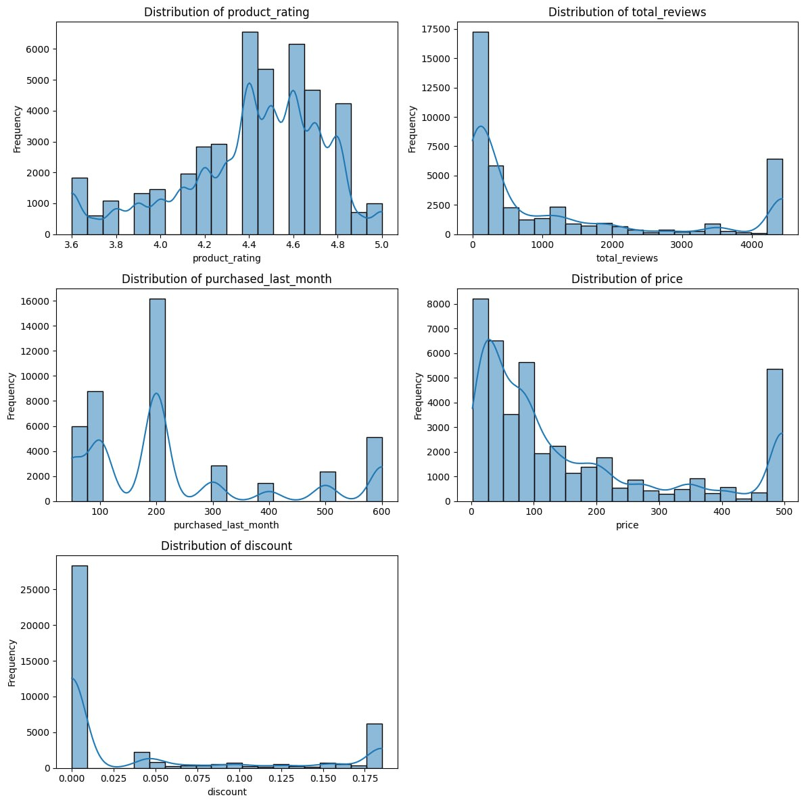
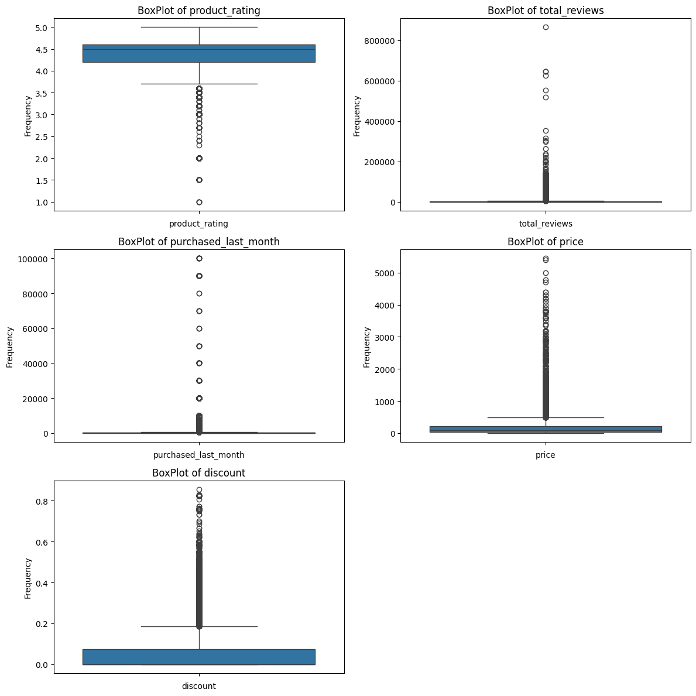
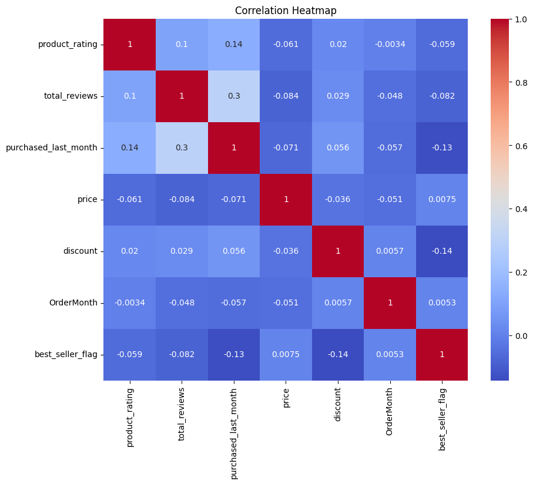
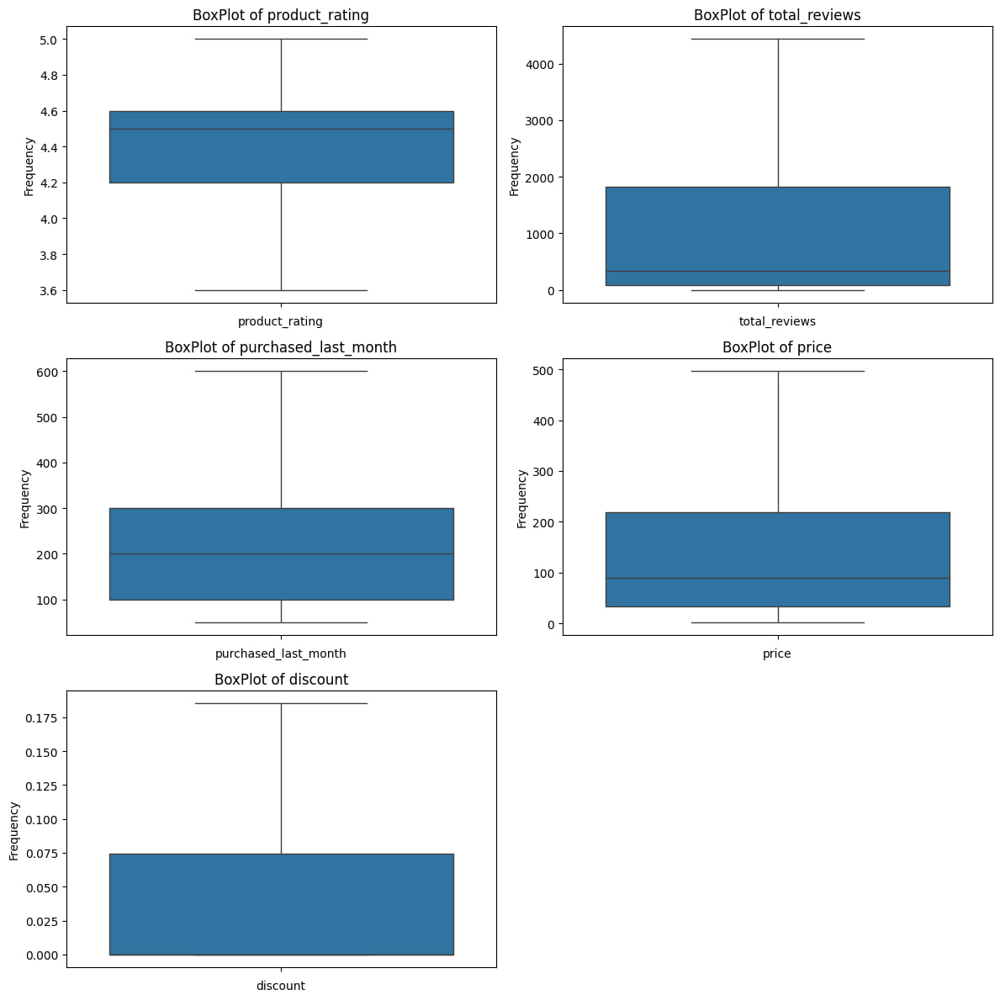
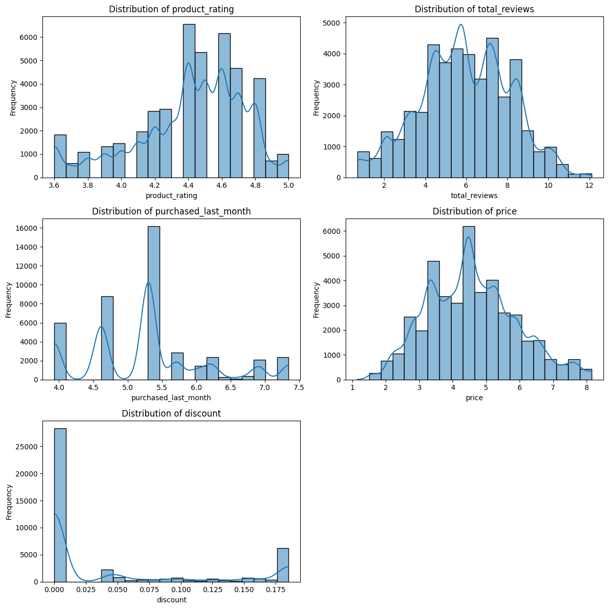
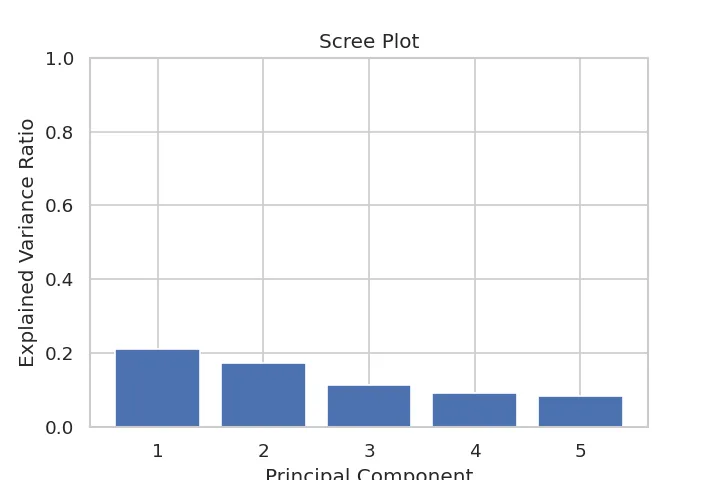
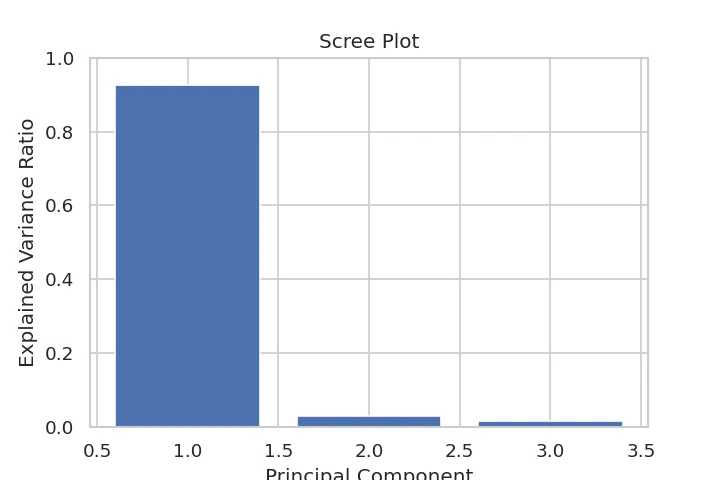

# **E-commerce Sales Optimization Project**

## **Introduction**
This project was developed for the **Data Analysis Algorithms** course at **Helwan National University**.   
_This is a team project. Refer to [Credits](#credits)._

## **For Local Run**

### 1. Clone the repository
```bash
git clone https://github.com/Yousefmedhat/Amazon-Sales-Optimization-Project.git  
cd Amazon-Sales-Optimization-Project
```
### 2. Install dependencies
```bash
pip install -r requirements.txt
```
### 3. Open the notebook

Use an IDE that supports Jupyter notebooks (VS Code, Jupyter Notebook, or Google Colab):  

- Open [`Amazon_Sales_Optimization.ipynb`](Amazon_Sales_Optimization.ipynb).

- You can run the cells interactively to execute the project code.

##  **Problem Definition**
Amazon is one of the largest e-commerce platforms globally, our objective is to analyze Amazon sales dataset and provide useful information about **sales trends** and **customer behavior** in order to **maximize revenue**.

   


> [Image by The Guardian](https://www.theguardian.com/technology/2022/jul/06/uk-watchdog-opens-investigation-into-amazon-marketplace-practices)

---

### **Dataset Description**
- The dataset provides detailed information on **42,000+** Amazon electronics products, including sales, ratings and pricing.
- Raw, original data, with alot of missing values and inconsistent entries, which makes it ideal for preprocessing practice and feature engineering.   
> [**Dataset on Kaggle**](https://www.kaggle.com/datasets/ikramshah512/amazon-products-sales-dataset-42k-items-2025?select=amazon_products_sales_data_uncleaned.csv)

##### **Features**:


1. **title** – Complete name/title of the product
1. **rating** – Average customer rating (numeric) out of 5
1. **number_of_reviews** – Total number of customer reviews
1. **bought_in_last_month** – Units purchased in the last month
1. **current/discounted_price** – Current price after applying discount
1. **price_on_variant** – Price of product variations
1. **listed_price** – Original listed price before discount
1. **is_best_seller** – Indicates if the product is tagged as a Best Seller
1. **is_sponsored** – Whether the product is a Sponsored item or Organic
1. **is_couponed** – Special discounted coupons
1. **buy_box_availability** – BuyBox button availability on Amazon
1. **delivery_details** – Estimated delivery date
1. **sustainability_badges** – Eco-friendly and sustainability-related tags
1. **image_url** – Direct image link of the product
1. **product_url** – Official Amazon product page URL
1. **collected_at** – Date when the data was collected  

## **Objective Tasks**
- **Data Wrangling** ⟶ Clean dataset, handle missing values,
duplicates, outliers, inconsistent formats.
- **Exploratory Data Analysis (EDA)** ⟶ Perform univariate & multivariate analyses.
Use appropriate visualizations with insights.
- **Feature Engineering & Selection** ⟶ Create new features, encode variables, apply
selection methods (filter, Lasso, RFE).
- **Probability  & Hypothesis Testing** ⟶ Fit distributions, calculate probabilities, and conduct hypothesis tests relevant to dataset.
- **Dimensionality Reduction (PCA)** ⟶ Apply PCA, interpret components, visualize clusters/patterns.
---

## **Technical Approach**
The following section discusses the technical implementation of the required objectives with details and the tools used to address them.  
Proceed to the [**Full notebook**](Amazon_Sales_Optimization.ipynb) to see the implementation.
#### **Tools:**
- **Google Colab** ⟶ Used to write code in `.ipynb` format that can be accessed and edited by the team.
- **Python Libraries** ⟶ Used libraries like `pandas`, `matplotlib`, `seaborn` to handle, analyze and visualze the data.
- **Github** ⟶ Used to save named versions of the notebook and to write and show the `README` file.

---


### **Data Cleaning**
- We started with loading the data using `KaggleDatasetAdapter` into a pandas dataframe.


- Handled inconsistent formats:
  - |           |  number_of_reviews |  bought_in_last_month    | price_on_variant             | listed_price |
    | ----------|:------------------:|:------------------------:|:----------------------------:| :-----------:|  
    | Old format| 3,044              | 2K+ bought in past month	| basic variant price: $162.24 | \$159.00     |  
    | New format| 3044               | 2000	                    | 162.24                       | 159.00       |


- Converted data types for columns:
    - | | product_rating |  number_of_reviews| bought_in_last_month | current/discounted_price |  price_on_variant |  listed_price | delivery_details | collected_at|   
      | --|:---------------:|:-------------------:|:----------------------:| :---------------:|:---------------:|:---------------:| :----------------------: | :---------------:|
      Old datatype | object | object | object | object | object | object | object | object | 
      New datatype | float | int | int | float | float | float |  datetime | datetime

      > All the invalid data converted to **NaN** using  `errors='coerce'`.  

  

- Handled Missing values:
  - Used data from **current/discounted_price**, **price_on_variant**, **listed_price** to fill the missing values in **current/discounted_price** and **listed_price**. 
  - Filled missing values in **rating** with `mean` since the column has limited outliers.     
  - Filled missing values in **numeric columns**
  with `median` because it's less sensetive to **outliers**.     
  - Filled missing values in delivery_details with the value in the previous row using `ffill`.
  - Filled missing values in **buy_box_availability** with "not available".

- Column Additions and Deletions:
  - Created new column `discount` that represents the discount percentage for products.
  - Created new column `category` to split products into **15 categories** based on keywords in the product title.
  - Created new columns `OrderMonth`,`OrderDayOfWeek` derived from **delivery_details**.
  - Dropped **current\discounted price** and **price_on_variant**, as **listed_price** and discount are sufficient.
  - Dropped **sustainability_badges** since $nan > 90%$.
  - Dropped **image_url** and **product_url**.


- Column Renaming:
  - |        | title         | rating            |    number_of_reviews | bought_in_last_month | listed_price | is_best_seller| buy_box_availability |  
    |--------|:-------------:|:-----------------:|:--------------------:|:--------------------:|:------------:|:--------------------:|  :--: |
    |New name| product_title | product_rating    | total_reviews        | purchased_last_month | price        |  badge    |is_available | 


### **Exploratory Data Analysis [EDA]**
- We performed univariate and multivariate analyses to gain insights.
- Used `matplotlib` and `seaborn` to make informative visualizations.
- Examples of visualizations:
    
  -   

  > Used **`barplot`** to show the most rated categories.

  - 

  > Used **`barplot`** to compare raitings between **organic** and **sponsored** in the top 5 categories by rating.

   - 

   > Used **`histogram`** to show the distribution of numeric features.

   - 

   > Used `boxblot` to show the the **skewness** and **outliers** of numeric features.

   - 

   > Used `heatmap` to show **correlation** between features.

### **Feature Engineering & Selection**
  - Handled outliers and skewness:

    - Used **IQR** method to numeric features to remove outliers.  

        

     > Distribution after applying **IQR**.

    - Applied **log transformation** to numeric features to normalize the data.
         

     > Distribution after applying **log transformation**.

  - Feature encoding:
    - Applied **`One Hot Encoding`** to **badge** column:
      
    | 	badge_Best Seller |	badge_Limited time deal | 	badge_No Badge | 	badge_Save |   
    |------------------- | ----------------------- | ---------------- | ----------- | 

    - Applied **`Binary Encoding`** to **is_sponsored** and **is_available**,
    since they have 2 distinct values only.  
    - Applied **`Frequency Encoding`** to other categorical features since they have high cardinality and no particular order.  
  - Feature Selection:
    - Applied **`Variance Treshold`** to remove low variace features.
    - Applied **`CFS`** to remove highly-correlated features.
    - Calculated **`Mutual Information`** to remove low-information features.

### **Hypothesis Testing**
- Conducted hypothesis testing using the `T-Test`:
  - $H_0$: Discounts do **not** have a significant effect on sales.  
    > Rejected $H_0$ since $p < \text{threshold}$ ⟶ Discounts have a significant effect on sales.  

  - $H_0$: Sponsored products do **not** have significantly higher sales.  
    > Rejected $H_0$ since $p < \text{threshold}$ ⟶ Sponsored products have significantly higher sales.
    
### **Dimensionality Reduction**  
  - Used **`PCA`** to reduce dimensionality and capture the main patterns in the data:
    - Applied **StandardScaler** to normalize features (mean = 0, variance = 1):  

    

    - Applied **RobustScaler** to handle outliers (centered using median, scaled by IQR):  
    
    

### **GUI**
- Check the the running GUI on [**`Gradio`**](https://3069be9da53628642f.gradio.live/) to get access to all the visualizations.
- OR run the code locally and access the GUI section. Refer to [Local Run](#for-local-run).

---

## **Credits**
[**`Yousef Medhat`**](https://www.linkedin.com/in/yousef-medhat-7293232a1/)  
[**`Yousef Waheed`**](https://www.linkedin.com/in/youssef-waheed-8462061a7/)  
[**`Ali Abdou`**](https://www.linkedin.com/in/ali-abdouu/)  
[**`Amira Azzam`**](https://www.linkedin.com/in/amira-azzam2510/)  
[**`Maria Gerges`**](https://www.linkedin.com/in/maria-gerges-81b04a30a/)

## **License**
This project is open source and available under the [MIT License](https://mit-license.org/).